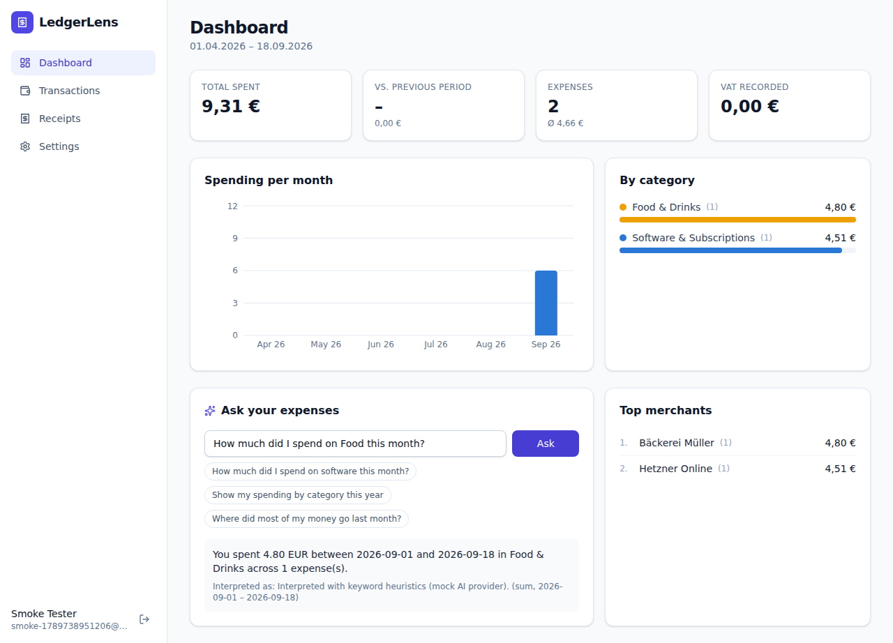
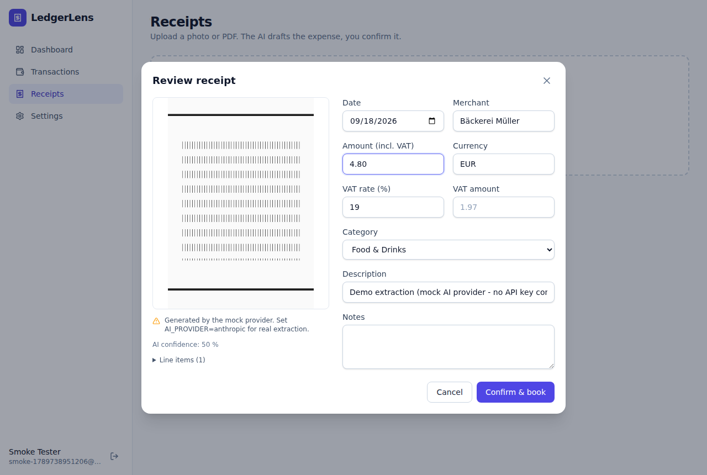
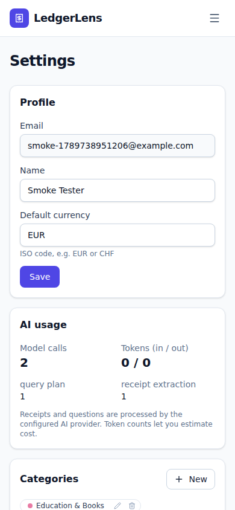

<p align="center">
  
</p>
<h1 align="center">LedgerLens</h1>
<p align="center">
  AI-assisted receipt capture and expense intelligence for freelancers, small businesses and students.<br/>
  <em>Photograph a receipt → validated, categorised booking in seconds → ask questions about your spending in plain language.</em>
</p>

<p align="center">
  <a href="https://github.com/Hamzo069/-personal-os-oder-future-project./actions/workflows/ci.yml"></a>
  
  
  
  
  
</p>

---



## Why this project exists

Bookkeeping for freelancers has one bottleneck: getting the data *off* the receipt. LedgerLens uses a
vision-capable LLM with **structured outputs** to draft the booking, keeps a **human in the loop** to
confirm it, and **learns** from every correction (merchant → category) without training a model.
Questions like *"How much did I spend on software in August?"* are answered by translating the question
into a **validated query plan** that the application executes itself – the model never sees your data
and never writes SQL.

It is built as a serious, extensible codebase rather than a demo: layered backend, typed API contract,
migrations, tests on every layer, security review, CI and Docker deployment.

## Features

| | |
|---|---|
| 🧾 **Receipt capture** | Drag & drop JPEG/PNG/WebP/PDF; type detection by magic bytes; background extraction with status polling |
| 🤖 **AI extraction** | Merchant, date, total, currency, VAT rate/amount, category, line items, confidence – validated against a Pydantic schema |
| ✅ **Review & book** | Nothing is booked until you confirm; corrections feed future suggestions (few-shot hints per merchant) |
| 💬 **Ask your expenses** | Natural-language questions → declarative query plan → deterministic answer from the database |
| 📊 **Dashboard** | Totals, change vs. previous period, VAT, monthly trend, categories, top merchants |
| 🗂 **Transactions** | Manual entry, filters, sorting, pagination, CSV export (Excel-friendly) |
| 🔐 **Security** | Argon2id, short-lived JWTs in memory, rotating httpOnly refresh cookies with reuse detection, rate limits, upload validation, per-user isolation |
| 🧪 **Quality** | 49 API tests, 14 frontend tests, Playwright smoke test, ruff/mypy/eslint/tsc in CI |
| 🔌 **Runs offline** | A deterministic mock AI provider – no API key needed for development, demos or tests |

<details>
<summary>More screenshots</summary>

| Receipt review (human-in-the-loop) | Mobile |
|---|---|
|  |  |

</details>

## Architecture at a glance

```
apps/web  React 19 · Vite · TypeScript · Tailwind 4 · TanStack Query · Recharts
   │   /api/v1 (JSON, Bearer token + httpOnly refresh cookie; same origin via Vite/nginx proxy)
apps/api  FastAPI · SQLAlchemy 2 · Alembic · Pydantic v2 · Argon2 · PyJWT · Anthropic SDK
   ├── core/      config, db, errors, security, rate limiting
   ├── models/    users, refresh_tokens, categories, transactions, receipts, category_feedback, ai_calls
   ├── schemas/   API contracts (request/response)
   ├── api/v1/    thin routers
   ├── services/  business logic (auth, transactions, receipts, insights, NL queries)
   ├── ai/        AIProvider protocol · Anthropic (structured outputs) · Mock · prompts
   └── storage/   local file storage (S3-ready interface)
SQLite for development & tests · PostgreSQL in production · Docker Compose · GitHub Actions
```

The full architecture, data model, auth flow, AI design, security review, deployment guide and a
12-month roadmap live in [`docs/`](docs) (written in German, the project's primary audience;
code, comments, commits and issues are English).

| Document | |
|---|---|
| [00 Projektauswahl](docs/00-projektauswahl.md) | Why this project – criteria and alternatives compared |
| [01 Produkt](docs/01-produkt.md) | Target group, problem, MVP scope, business model |
| [02 Architektur](docs/02-architektur.md) | Stack rationale, layers, frontend↔backend communication, scaling path |
| [03 Datenmodell](docs/03-datenmodell.md) | Tables, relations, deletion concept, migrations |
| [04 Authentifizierung](docs/04-authentifizierung.md) | Argon2, JWT, refresh rotation, CSRF/XSS reasoning |
| [05 API](docs/05-api.md) | Endpoint reference and curl examples |
| [06 KI-Integration](docs/06-ki-integration.md) | Structured outputs, learning loop, query planning vs. text-to-SQL, costs, privacy |
| [07 Security Review](docs/07-security-review.md) | Threat model, measures, remaining risks |
| [08 Deployment](docs/08-deployment.md) | Docker Compose on a VPS, managed platforms, environment variables |
| [09 Roadmap](docs/09-roadmap.md) | 12 months, linked to GitHub issues |
| [Lernpfad](docs/lernpfad.md) | A six-week guided tour through the codebase |
| [ADRs](docs/adr) | Architecture decision records |

## Quick start (local, no Docker, no API key)

Prerequisites: [uv](https://docs.astral.sh/uv/) and Node.js 22+. uv installs the pinned Python version
(3.12, see `apps/api/.python-version`) automatically. On Windows, install the tools with
`winget install astral-sh.uv OpenJS.NodeJS.LTS Git.Git` and run the same commands in PowerShell.

```bash
git clone https://github.com/Hamzo069/-personal-os-oder-future-project. ledgerlens
cd ledgerlens

# 1) API  (SQLite + mock AI provider by default)
cd apps/api
uv sync --extra dev
cp ../../.env.example .env          # optional – defaults work for development
uv run alembic upgrade head          # optional: in development the API also migrates on start
uv run uvicorn app.main:app --reload --port 8000
#   → http://localhost:8000/docs (Swagger UI)

# 2) Web  (new terminal)
cd apps/web
npm ci
npm run dev
#   → http://localhost:5173
```

Register an account, upload `apps/web/e2e/receipt.png` (or any receipt), review the draft and book
it. Without an API key the mock provider returns a demo extraction – the whole product flow works.

**Real AI:** set in `apps/api/.env`

```
AI_PROVIDER=anthropic
ANTHROPIC_API_KEY=sk-ant-...
ANTHROPIC_MODEL=claude-opus-5        # or claude-sonnet-5 for cheaper bulk processing
```

Or use the Makefile: `make install`, `make api`, `make web`, `make check`.

## Running with Docker (PostgreSQL + API + nginx, optional Caddy for HTTPS)

```bash
cp .env.example .env              # set SECRET_KEY and POSTGRES_PASSWORD
docker compose up --build -d      # → http://localhost:8080

# On a public server: also set DOMAIN, CORS_ORIGINS=https://<DOMAIN> and COOKIE_SECURE=true
docker compose --profile https up --build -d   # → https://<DOMAIN>, certificate via Let's Encrypt
```

`deploy/smoke-test.sh` checks a running stack end to end; CI runs it on every push.
See [docs/08-deployment.md](docs/08-deployment.md) for the step-by-step server setup, backups and
managed platforms.

## Tests and quality gates

```bash
make check                      # everything CI runs

cd apps/api && uv run pytest -q                 # API tests (SQLite, mock AI, no network)
cd apps/api && uv run ruff check . && uv run mypy app
cd apps/web && npm test && npm run lint && npm run typecheck && npm run build
cd apps/web && npx playwright install chromium && npm run test:e2e   # against a running stack
```

CI (`.github/workflows/ci.yml`) runs lint, type checks, tests and Docker builds for both apps on every
push and pull request.

## Project structure

```
.
├── apps/api/           FastAPI backend (see apps/api/README.md)
├── apps/web/           React frontend
├── docs/               architecture, product, security, deployment, roadmap, ADRs, screenshots
├── .github/            CI workflow, issue and PR templates
├── docker-compose.yml  production-like stack
├── Makefile            common commands
└── .env.example        all configuration options, documented
```

## Roadmap (short)

Job queue for extraction · S3 storage · Redis rate limiting · e-mail verification & password reset ·
budgets & alerts · recurring-expense detection · DATEV export · multi-currency · bank import with
matching · duplicate detection · German UI · dark mode · extraction evaluation set.
Details and issue links: [docs/09-roadmap.md](docs/09-roadmap.md) ·
[open issues](https://github.com/Hamzo069/-personal-os-oder-future-project./issues).

## Contributing

1. Create a branch, keep commits focused (`feat:`, `fix:`, `test:`, `docs:`, `chore:`).
2. Add tests for behaviour changes; update docs/ADRs for architectural ones.
3. `make check` must pass. Open a pull request using the template.

## License

MIT – see [LICENSE](LICENSE).
